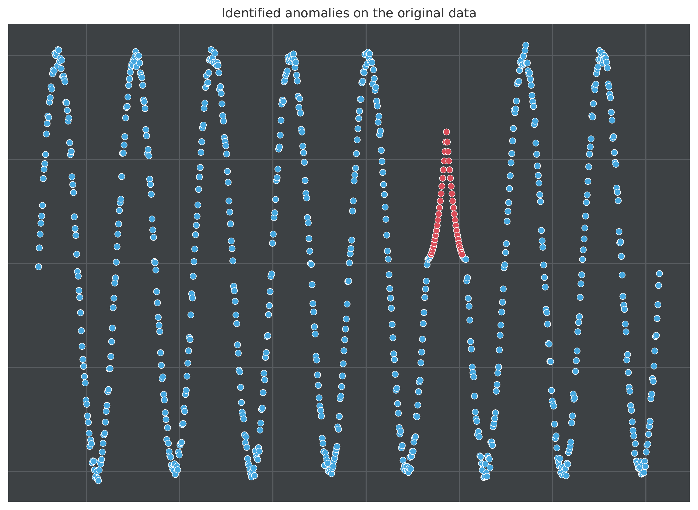

# Dockerized Anomaly Detection

This repository contains the files required for the generation and consequent publication (push) of a Docker image containing python code. The code's functionality concerns the generation of mock data and the application of unsupervised anomaly detection on these data.

More specifically, the generated data corresponds to 800 points of a noisy sine curve (see figure below), where 50 datapoints have been replaced with points generated from a different function. This different function shows some similarities to the sine curve, in order for the anomaly detection to be a non-trivial task. The detector used for the anomaly detection is `SeasonalAD` from the Anomaly Detection Toolkit ([ADTK](https://arundo-adtk.readthedocs-hosted.com/en/stable/)), which corresponds to a time-series detector that detects anomalous violations of seasonal patterns.

The results can be seen in the following figure, where the detector successfully identifies 41 of the 50 anomalous points. The remaining 9 are not identified because they are very close to the original points generated from the noisy sine function.

  

In order to run the code, you must first pull the image from the present repository's packages, or simply run

`docker pull ghcr.io/srigas/docker_anomaly_detection:main`

Then, once the image is pulled, simply execute a `docker run` command. Note that the code's output includes the generated dataset, as well as before and after files, which are visualizations of the generated datapoints and the identified anomalies, respectively. In order to gain access to these files you must override the entry point when running the image in a container by writing

`docker run -it --entrypoint=/bin/bash image_name`,

where `image_name` is the pulled image's name. This allows you to run the image in a container which you can access through an interactive terminal. Once inside, you may execute `python build_data.py && python code.py` to get the results of the data generation and the subsequent anomaly detection. If you want to copy these files locally, you may run

`docker cp CONTAINER_ID/home/app/FILE ~PATH`,

where `CONTAINER_ID` is the ID of the container in which the image is running, `FILE` is the name of the file you wish to copy (for example, after.pdf) and `PATH` is the path to which you wish to copy the file (for example, /Desktop).
